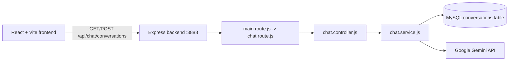

# Gemini Clone

This project is a small full-stack Gemini-style chat application. The React frontend sends questions to an Express backend. The backend loads recent messages from MySQL, sends the conversation history and the new question to Google's Gemini API, stores both messages, and returns the new user and assistant records.

## Architecture



## Project Structure

```text
GPT_CLONE/
├── backend/
│   ├── .env                         # Local secrets and database settings
│   ├── db/
│   │   ├── database.sql             # Conversations table definition
│   │   └── dbConfig.js              # MySQL connection pool
│   ├── server.js                    # Express application and startup
│   ├── package.json                 # Backend dependencies
│   └── src/
│       ├── api/
│       │   ├── main.route.js        # Mounts feature routers under /api
│       │   └── chat/
│       │       ├── chat.route.js    # Chat endpoint definitions
│       │       ├── controller/
│       │       │   └── chat.controller.js
│       │       └── service/
│       │           └── chat.service.js
│       ├── middleware/
│       │   └── error.handler.js     # Shared error middleware
│       └── utils/                   # Reserved for shared helpers
└── frontend/
    ├── package.json
    ├── vite.config.js
    └── src/
        ├── main.jsx                 # React entry point
        ├── App.jsx                  # Application state and API calls
        ├── App.css
        └── components/
            ├── Sidebar/
            ├── ChatHeader/
            ├── MessageList/
            ├── ChatMessage/
            └── ChatInput/
```

## Backend Setup

Open a terminal in `backend`:

```bash
npm install
```

Create `backend/.env` with values for your local MySQL installation and Gemini account:

```env
DB_HOST=localhost
DB_USER=your_mysql_user
DB_PASSWORD=your_mysql_password
DB_NAME=chatgpt_clone
GEMINI_API_KEY=your_gemini_api_key
GEMINI_MODEL_NAME=your_supported_gemini_model
```

Never commit `.env` or place an API key in frontend code. The existing `.env` contains a credential; rotate it in Google AI Studio if it has been shared or committed anywhere.

Create the database and table using the SQL in `backend/db/database.sql`. Verify the SQL syntax for your MySQL version before running it; the current draft uses `{` after `CREATE TABLE` and the role value `asistant`, which should normally be corrected to `(` and `assistant`.

Start the backend:

```bash
node server.js
```

The server checks the MySQL pool before listening at `http://localhost:3888`.

## Frontend Setup

Open a second terminal in `frontend`:

```bash
npm install
npm run dev
```

The Vite development server prints its local URL, normally `http://localhost:5173`.

The frontend currently uses this API base URL in `src/App.jsx`:

```js
const API_BASE_URL = 'http://localhost:3777/api';
```

Because the backend listens on port `3888`, change that value to:

```js
const API_BASE_URL = 'http://localhost:3888/api';
```

The backend does not currently configure CORS. If the browser blocks requests from the Vite origin, add and configure the `cors` package in the backend.

## Request Flow

### 1. Application startup

1. `backend/server.js` creates the Express application.
2. `express.json()` parses JSON request bodies.
3. `main.route.js` is mounted at `/api`.
4. `main.route.js` mounts the chat router at `/chat`.
5. The server obtains and releases a MySQL connection.
6. Express starts listening on port `3888`.

### 2. Create a conversation

Request:

```http
POST http://localhost:3888/api/chat/conversations
Content-Type: application/json
```

Body:

```json
{
  "question": "What is AI?"
}
```

Execution path:

1. `chat.route.js` sends the request to `createConversationController`.
2. The controller reads `req.body.question`.
3. `createConversationService` rejects an empty question.
4. `getRecentConversationsRows(5)` selects recent messages and reverses them into chronological order.
5. The new user question is inserted into `conversations`.
6. Each history row is converted to Gemini's format:

   ```js
   {
     role: 'user' | 'model',
     parts: [{ text: 'message content' }]
   }
   ```

7. `geminiClient.chats.create()` creates a Gemini chat with the selected model and history.
8. `chat.sendMessage({ message: question })` asks Gemini for a response.
9. The generated answer is logged as `Gemini response: ...` in the backend terminal.
10. The assistant answer and token count are inserted into MySQL.
11. Both inserted rows are fetched by ID.
12. The controller returns the records in `response.data.data`.

Successful response shape:

```json
{
  "success": true,
  "message": "Conversation created successfully",
  "data": {
    "userConversation": {},
    "assistantConversation": {}
  }
}
```

### 3. Fetch conversations

Request:

```http
GET http://localhost:3888/api/chat/conversations
```

The controller calls `getRecentConversationsRows(100)` and returns the resulting array in `response.data.data`.

## Database Model

The `conversations` table is intended to contain:

| Column | Purpose |
| --- | --- |
| `id` | Auto-incrementing message identifier |
| `role` | `user` or `assistant` |
| `content` | The question or generated answer |
| `token_count` | Gemini token usage for assistant messages |
| `created_at` | Message creation timestamp |

There is no conversation ID or user ID yet. All messages therefore belong to one shared chronological stream.

## Frontend Responsibilities

- `main.jsx` mounts `App` inside React `StrictMode`.
- `App.jsx` owns the conversation list and loading state.
- On mount, `App.jsx` requests existing conversations.
- `handleSendMessage` adds an optimistic user message, posts the question, then replaces it with the database-backed user and assistant messages.
- `ChatInput` manages the text field and prevents empty or duplicate submissions while loading.
- `MessageList` renders the empty state, messages, loading indicator, and automatic scroll target.
- `ChatMessage` renders user text directly and assistant content as Markdown with syntax highlighting support.
- `Sidebar` and `ChatHeader` provide the surrounding application layout.

## Postman Testing

1. Start MySQL.
2. Start the backend from the `backend` directory.
3. Create a `POST` request to `http://localhost:3888/api/chat/conversations`.
4. Select `Body > raw > JSON`.
5. Send `{ "question": "What is AI?" }`.
6. Read the generated answer in Postman under `data.assistantConversation.content`.
7. Read the same answer in the backend terminal after `Gemini response:`.
8. Use the GET endpoint to inspect stored messages.

## Known Issues and Maintenance Notes

- The frontend API URL currently uses port `3777`; the backend uses `3888`.
- The frontend expects `response.data.data.conversations`, but the GET backend currently returns the array directly as `response.data.data`. Align one side of this contract before relying on initial history loading.
- The current error handler logs the error and returns before `res.status(...).json(...)`, so failed requests may hang instead of returning JSON. Remove the early `return` if an HTTP error response is required.
- Keep Gemini history roles as `assistant` in the database and map them to Gemini's `model` role.
- The assistant answer is logged only after Gemini responds successfully; API, database, or validation failures are handled by the error path.
- Add authentication, per-user conversations, rate limiting, request validation, and a transaction around the user/assistant inserts before deploying publicly.

## Useful Commands

Backend:

```bash
npm install
node server.js
```

Frontend:

```bash
npm install
npm run dev
npm run build
npm run lint
```


## 1. Anatomy of an AI Application
*******************************
A standard modern AI application follows a three-tier design pattern[cite: 1]. A helpful conceptual frame is a high-end restaurant[cite: 1]:

  The Chef (AI Model): Executes recipes inside the kitchen strictly based on incoming order tickets[cite: 1].

  The Waiter (Backend): Sanitizes, structures, and validates orders before routing them[cite: 1].

  The Dining Room (Frontend): Provides the customer-facing interface where interactions occur[cite: 1].

  ┌────────────────┐         ┌─────────────────────────┐         ┌─────────────────────────┐
  │   Frontend     │  ────>  │         Backend         │  ────>  │    Brain (LLM API)      │
  │   (User UI)    │  <────  │ (Orchestrator/Guard)    │  <────  │    (Inference Engine)   │
  └────────────────┘         └─────────────────────────┘         └─────────────────────────┘


 # 1.1 The Brain (LLM API – Inference Layer)
Role: Serves as the raw intelligence layer, translating structured text payloads into neural computations[cite: 1].

Hosted Providers: External endpoints such as OpenAI, Anthropic, or Google Gemini[cite: 1].

Isolation: The model has zero direct awareness of application users; it strictly evaluates text context provided in individual payloads[cite: 1].

# 1.2 The Backend (Orchestrator)
Role: The core business logic layer built using frameworks like FastAPI or Node.js/Express[cite: 1].

Primary Responsibilities:

Prompt Engineering & Formatting: Transforming raw user input into structured model contexts[cite: 1].

Guardrails & Security: Filtering malicious inputs (e.g., prompt injections) and performing user authentication[cite: 1].

Async Task Handling: Managing streaming payloads and avoiding gateway timeout limits[cite: 1].

# 1.3 The Frontend (Interface)
Role: The client application (React, Next.js, etc.) where users input queries and consume output[cite: 1].

Real-time UX: Utilizes Server-Sent Events (SSE) or WebSockets to stream incoming model tokens as they generate, producing a dynamic typing response[cite: 1].

## 2. Essential Terminology for AI Architectures
# 2.1 Context Window
The maximum token volume an LLM can parse and evaluate in a single request lifecycle[cite: 1].

Scale Reference (1 Million Tokens Capacity):

        ~50,000 lines of standard source code[cite: 1]

        ~8 average-length English novels[cite: 1]

        ~200 podcast episode transcriptions[cite: 1]

        ~9.5 hours of plain audio data[cite: 1]

# 2.2 TokensDefinition: The fundamental computational unit used by an LLM to parse and generate text (typically a fraction of a word)[cite:
    1].Rule of Thumb: 1 token = English words.Impact: Direct driver of operational API billing and hardware memory consumption (context window)[cite: 1].

# 2.3 Parameters / Weights
Definition: The underlying numerical coefficients optimized during neural network training[cite: 1].

Scale Implications:

Small (~7B Parameters): Can be executed locally on consumer hardware (e.g., laptops)[cite: 1].

Large (>400B Parameters): Requires distributed datacenter-grade GPU clusters[cite: 1].

# 2.4 Inference & Performance
Training vs. Inference: Training is the upfront cost of computing weights; inference is the recurring cost paid every time a user executes a query[cite: 1].

Latency vs. Throughput Trade-off:

Interactive Applications (Chatbots): Demand low latency (minimal time to first token)[cite: 1].

Batch Processing Systems: Prioritize high throughput (total documents processed per second) over individual response speed[cite: 1].

## 3. Controlling the Model (The Knobs)Sampling techniques dictate the statistical probabilities when picking subsequent tokens during decoding[cite: 1].

 # 3.1 Temperature – The Creativity ThermostatAdjusts the entropy of the output probability distribution [typically scaled 0.0 to 2.0](cite: 1).
  Low Values (0.0 - 0.3): Highly deterministic, conservative, and focused[cite: 1].High Values (0.7 - 1.5): More creative, diverse, and unpredictable[cite: 1].

  3.2 Top-k – Restricting the Candidate PoolRestricts token sampling exclusively to the top $k$ most probable candidates[cite: 1].k SettingSearch SpaceBehavior Example ("I like to drink...")Small ($k=5$)Strict & Concentrated{water, coffee, tea, juice, milk}[cite: 1]Large ($k=50$)Broad & Varied{smoothies, cocktails, hot chocolate, kombucha, ...}[cite: 1]3.3 Top-p (Nucleus Sampling) – A Dynamic FilterAccumulates tokens ordered by probability until their cumulative distribution reaches threshold $p$[cite: 1].Dynamic Adaptation: Automatically expands candidate pools for open-ended queries and narrows them for obvious choices[cite: 1].Example:Prompt: "The capital of France is..."With $p=0.9$, the candidate pool collapses overwhelmingly onto "Paris"[cite: 1].3.4 Configuration Summary TableUse Case CategoryTarget TemperatureTarget Top-pPrimary ObjectiveCoding & Technical Q&ALow ($\approx 0.2$)[cite: 1]Moderate ($\approx 0.8$)[cite: 1]Deterministic, correct syntax[cite: 1]Creative Writing & BrainstormingHigh ($\approx 0.8 - 1.0$)High ($\approx 0.95$)Maximum output variation4. Model Selection StrategyChoosing the right foundational model requires balancing hardware constraints, task complexity, and financial budgets[cite: 1].                          ┌────────────────────────┐
                          │ Model Selection Matrix │
                          └───────────┬────────────┘
                                      │
         ┌────────────────────────────┼────────────────────────────┐
         ▼                            ▼                            ▼
┌─────────────────┐          ┌─────────────────┐          ┌─────────────────┐
│ Parameter Size  │          │ Context Window  │          │ Cost/Capability │
│ (Edge vs Cloud) │          │ (Short vs Long) │          │ (Fast vs Smart) │
└─────────────────┘          └─────────────────┘          └─────────────────┘
4.1 Parameter SizeSmall Language Models (SLMs: 1B - 8B):
      Ideal for edge computing, low-latency applications, and targeted domain-specific tasks.
      
      Large Language Models (LLMs: 70B+): Essential for multi-step reasoning, complex chain-of-thought problems, and coding tasks[cite: 1].4.2 Context Window CapacitySelect models with smaller windows for transactional API calls to lower latency.
      Utilize extended context models (e.g., 1M+ tokens) when performing global document analysis, repository audits, or extensive conversation tracking[cite: 1].4.3 Modality ConsiderationsText-Only: Optimized for pure text generation, classification, and transformation tasks.Multimodal: Supports text, image, audio, and video ingestion natively within the context stream[cite: 1].4.4 Capability & Pricing Trade-offsDeploy smaller, cheaper models for routine classification or formatting.Reserve top-tier reasoning engines (e.g., GPT-4 class or Claude 3.5 Sonnet) for high-stakes problem-solving to optimize total system cost per token[cite: 1].5. Prompt Engineering Strategies5.1 Core Architecture of a PromptAn enterprise-grade prompt should separate instructions, context, input data, and output formatting:Markdown[SYSTEM INSTRUCTION]
Act as an expert software architect. Respond strictly in JSON format.

[CONTEXT]
The target platform is a serverless Microservices architecture running on AWS.

[USER INPUT]
Design a scalable message queue strategy for standard order processing.

[OUTPUT FORMAT]
{
  "strategy_name": "String",
  "components": ["List"],
  "trade_offs": "String"
}
5.2 Key Engineering TechniquesZero-Shot Prompting: Requesting output without providing explicit training examples.Few-Shot Prompting: Providing $N$ input/output pairs within the prompt to enforce strict output schemas.Chain-of-Thought (CoT): Instructing the model to "think step-by-step" before producing a final answer, improving logical accuracy on complex tasks.5.3 System vs. User PromptsSystem Prompt: Sets foundational behavior, guardrails, constraints, and operational personas. Holds higher operational priority.User Prompt: Contains runtime input, specific queries, or immediate tasks executed by the end-user[cite: 1]