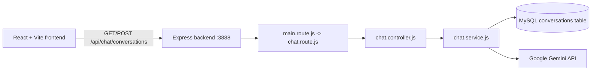

# Gemini Clone

This project is a small full-stack Gemini-style chat application. The React frontend sends questions to an Express backend. The backend loads recent messages from MySQL, sends the conversation history and the new question to Google's Gemini API, stores both messages, and returns the new user and assistant records.

## Architecture



## Project Structure

```text
GPT_CLONE/
├── backend/
│   ├── .env                         # Local secrets and database settings
│   ├── db/
│   │   ├── database.sql             # Conversations table definition
│   │   └── dbConfig.js              # MySQL connection pool
│   ├── server.js                    # Express application and startup
│   ├── package.json                 # Backend dependencies
│   └── src/
│       ├── api/
│       │   ├── main.route.js        # Mounts feature routers under /api
│       │   └── chat/
│       │       ├── chat.route.js    # Chat endpoint definitions
│       │       ├── controller/
│       │       │   └── chat.controller.js
│       │       └── service/
│       │           └── chat.service.js
│       ├── middleware/
│       │   └── error.handler.js     # Shared error middleware
│       └── utils/                   # Reserved for shared helpers
└── frontend/
    ├── package.json
    ├── vite.config.js
    └── src/
        ├── main.jsx                 # React entry point
        ├── App.jsx                  # Application state and API calls
        ├── App.css
        └── components/
            ├── Sidebar/
            ├── ChatHeader/
            ├── MessageList/
            ├── ChatMessage/
            └── ChatInput/
```

## Backend Setup

Open a terminal in `backend`:

```bash
npm install
```

Create `backend/.env` with values for your local MySQL installation and Gemini account:

```env
DB_HOST=localhost
DB_USER=your_mysql_user
DB_PASSWORD=your_mysql_password
DB_NAME=chatgpt_clone
GEMINI_API_KEY=your_gemini_api_key
GEMINI_MODEL_NAME=your_supported_gemini_model
```

Never commit `.env` or place an API key in frontend code. The existing `.env` contains a credential; rotate it in Google AI Studio if it has been shared or committed anywhere.

Create the database and table using the SQL in `backend/db/database.sql`. Verify the SQL syntax for your MySQL version before running it; the current draft uses `{` after `CREATE TABLE` and the role value `asistant`, which should normally be corrected to `(` and `assistant`.

Start the backend:

```bash
node server.js
```

The server checks the MySQL pool before listening at `http://localhost:3888`.

## Frontend Setup

Open a second terminal in `frontend`:

```bash
npm install
npm run dev
```

The Vite development server prints its local URL, normally `http://localhost:5173`.

The frontend currently uses this API base URL in `src/App.jsx`:

```js
const API_BASE_URL = 'http://localhost:3777/api';
```

Because the backend listens on port `3888`, change that value to:

```js
const API_BASE_URL = 'http://localhost:3888/api';
```

The backend does not currently configure CORS. If the browser blocks requests from the Vite origin, add and configure the `cors` package in the backend.

## Request Flow

### 1. Application startup

1. `backend/server.js` creates the Express application.
2. `express.json()` parses JSON request bodies.
3. `main.route.js` is mounted at `/api`.
4. `main.route.js` mounts the chat router at `/chat`.
5. The server obtains and releases a MySQL connection.
6. Express starts listening on port `3888`.

### 2. Create a conversation

Request:

```http
POST http://localhost:3888/api/chat/conversations
Content-Type: application/json
```

Body:

```json
{
  "question": "What is AI?"
}
```

Execution path:

1. `chat.route.js` sends the request to `createConversationController`.
2. The controller reads `req.body.question`.
3. `createConversationService` rejects an empty question.
4. `getRecentConversationsRows(5)` selects recent messages and reverses them into chronological order.
5. The new user question is inserted into `conversations`.
6. Each history row is converted to Gemini's format:

   ```js
   {
     role: 'user' | 'model',
     parts: [{ text: 'message content' }]
   }
   ```

7. `geminiClient.chats.create()` creates a Gemini chat with the selected model and history.
8. `chat.sendMessage({ message: question })` asks Gemini for a response.
9. The generated answer is logged as `Gemini response: ...` in the backend terminal.
10. The assistant answer and token count are inserted into MySQL.
11. Both inserted rows are fetched by ID.
12. The controller returns the records in `response.data.data`.

Successful response shape:

```json
{
  "success": true,
  "message": "Conversation created successfully",
  "data": {
    "userConversation": {},
    "assistantConversation": {}
  }
}
```

### 3. Fetch conversations

Request:

```http
GET http://localhost:3888/api/chat/conversations
```

The controller calls `getRecentConversationsRows(100)` and returns the resulting array in `response.data.data`.

## Database Model

The `conversations` table is intended to contain:

| Column | Purpose |
| --- | --- |
| `id` | Auto-incrementing message identifier |
| `role` | `user` or `assistant` |
| `content` | The question or generated answer |
| `token_count` | Gemini token usage for assistant messages |
| `created_at` | Message creation timestamp |

There is no conversation ID or user ID yet. All messages therefore belong to one shared chronological stream.

## Frontend Responsibilities

- `main.jsx` mounts `App` inside React `StrictMode`.
- `App.jsx` owns the conversation list and loading state.
- On mount, `App.jsx` requests existing conversations.
- `handleSendMessage` adds an optimistic user message, posts the question, then replaces it with the database-backed user and assistant messages.
- `ChatInput` manages the text field and prevents empty or duplicate submissions while loading.
- `MessageList` renders the empty state, messages, loading indicator, and automatic scroll target.
- `ChatMessage` renders user text directly and assistant content as Markdown with syntax highlighting support.
- `Sidebar` and `ChatHeader` provide the surrounding application layout.

## Postman Testing

1. Start MySQL.
2. Start the backend from the `backend` directory.
3. Create a `POST` request to `http://localhost:3888/api/chat/conversations`.
4. Select `Body > raw > JSON`.
5. Send `{ "question": "What is AI?" }`.
6. Read the generated answer in Postman under `data.assistantConversation.content`.
7. Read the same answer in the backend terminal after `Gemini response:`.
8. Use the GET endpoint to inspect stored messages.

## Known Issues and Maintenance Notes

- The frontend API URL currently uses port `3777`; the backend uses `3888`.
- The frontend expects `response.data.data.conversations`, but the GET backend currently returns the array directly as `response.data.data`. Align one side of this contract before relying on initial history loading.
- The current error handler logs the error and returns before `res.status(...).json(...)`, so failed requests may hang instead of returning JSON. Remove the early `return` if an HTTP error response is required.
- Keep Gemini history roles as `assistant` in the database and map them to Gemini's `model` role.
- The assistant answer is logged only after Gemini responds successfully; API, database, or validation failures are handled by the error path.
- Add authentication, per-user conversations, rate limiting, request validation, and a transaction around the user/assistant inserts before deploying publicly.

## Useful Commands

Backend:

```bash
npm install
node server.js
```

Frontend:

```bash
npm install
npm run dev
npm run build
npm run lint
```